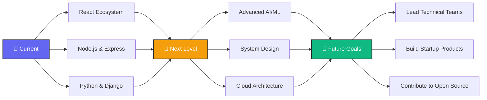

<div align="center">

<!-- Premium Header with Enhanced Styling -->


<!-- Enhanced Typing Animation -->
<div align="center" style="margin: 20px 0;">
  
</div>

<!-- Premium Divider -->


</div>

<!-- About Me Section with Enhanced Layout -->
<div align="center">

## 🚀 About Me

</div>

<table align="center" width="100%">
<tr>
<td width="60%" valign="top">

```typescript
const faizaAshfaq = {
  title: "Software Engineer",
  education: "Software Engineering @ NED University 🎓",
  currentRole: "Frontend Developer @ Lambda Theta 💼",
  location: "Karachi, Pakistan 🇵🇰",
  
  expertise: {
    frontend: ["React", "Next.js", "TypeScript", "Tailwind CSS"],
    backend: ["Node.js", "Django", "Python", "Express.js"],
    database: ["MongoDB", "PostgreSQL", "Firebase", "Redis"],
    ai_ml: ["TensorFlow", "PyTorch", "OpenAI API", "NLP"],
    tools: ["Git", "Docker", "AWS", "Vercel", "Postman"]
  },
  
  currentlyFocused: [
    "Advanced AI Integration with Full-Stack",
    "System Design & Architecture",
    "Open Source Contributions",
    "Building Impactful Solutions"
  ],
  
  lifePhilosophy: "Code with purpose, build with passion! ✨"
};
```

### 🌟 My Journey

**🎓 Background:** Recent Software Engineering graduate with a passion for creating meaningful solutions that solve real-world problems through innovative web technologies and AI.

**💼 Present:** Currently crafting exceptional user experiences as a Frontend Developer while actively building impactful side projects that push the boundaries of what's possible.

**🚀 Future Vision:** Exploring the fascinating intersection of AI and Full-Stack development to create tools that genuinely improve people's lives and workflows.

</td>
<td width="40%" valign="top">
<div align="center">


<!-- Enhanced Stats Cards -->
<div align="center" style="margin-top: 20px;">

[](https://github.com/Faiza123-eng)

[](https://github.com/Faiza123-eng)

[](https://github.com/Faiza123-eng)

</div>
</td>
</tr>
</table>

<!-- Enhanced Tech Stack Section -->
<div align="center">
<br>

## 🛠️ Tech Arsenal & Expertise

### 🎨 Frontend Mastery
<div style="margin: 15px 0;">

</div>

### ⚙️ Backend Power
<div style="margin: 15px 0;">

</div>

### 🗄️ Database Solutions
<div style="margin: 15px 0;">

</div>

### 🤖 AI/ML & Development Tools
<div style="margin: 15px 0;">

</div>

<!-- Skill Level Indicators -->
<div align="center" style="margin-top: 30px;">

| **Category** | **Proficiency** | **Experience** |
|:---:|:---:|:---:|
| 🎨 **Frontend Development** |  | 1+ Years |
| ⚙️ **Backend Development** |  | 1+ Years |
| 🤖 **AI/ML Integration** |  | 1+ Years |
| 🚀 **System Design** |  | 6 mons |

</div>

</div>

<!-- Enhanced GitHub Analytics -->
<div align="center">
<br>

## 📊 GitHub Analytics & Performance

<!-- Premium Stats Grid -->
<div align="center">
<table>
<tr>
<td width="50%">

</td>
<td width="50%">

</tr>
<tr>
<td width="50%">

</td>
<td width="50%">

</td>
</tr>
</table>
</div>

<!-- Enhanced Contribution Snake -->
<div align="center" style="margin: 30px 0;">

</div>

<!-- Achievement Badges -->
<div align="center">

### 🏆 GitHub Achievements

[](https://github.com/ryo-ma/github-profile-trophy)

</div>

</div>

<!-- Premium Divider -->


<!-- Enhanced Featured Projects Section -->
<div align="center">

# 🎯 Featured Projects Portfolio

<div align="center">

</div>

</div>

<!-- Enhanced Project Cards with Better Styling -->
<div align="center">

<table width="100%">
<tr>
<td width="50%" valign="top">

### 💬 IntellectPrep
**🤖 AI-Powered Interview Preparation Platform**

<div align="center">


</div>

**🎯 Core Features:**
- 🧠 **Smart AI Question Generation** - Personalized DSA challenges
- 🎭 **Realistic Mock Interviews** - AI-powered feedback system  
- 📈 **Performance Analytics** - Detailed progress tracking
- 🎓 **Adaptive Learning** - Difficulty scales with your growth

**💫 Impact:** Revolutionizing technical interview preparation for developers worldwide

**🔥 Tech Stack:**
<div align="center">


</div>

<div align="center" style="margin-top: 15px;">
<a href="https://github.com/Faiza123-eng/Intellectprep">

</a>
</div>

</td>
<td width="50%" valign="top">

### 🐞 Bug Tracker Pro
**🏢 Enterprise-Grade Issue Management System**

<div align="center">


</div>

**🎯 Core Features:**
- 🔐 **Advanced Role-Based Access** - Secure permission system
- 🎫 **Smart Ticket Management** - Complete lifecycle tracking
- ⚡ **Real-time Collaboration** - Live updates & notifications
- 📊 **Analytics Dashboard** - Comprehensive reporting suite

**💫 Impact:** Streamlining development workflows for teams globally

**🔥 Tech Stack:**
<div align="center">


</div>

<div align="center" style="margin-top: 15px;">
<a href="https://github.com/Faiza123-eng/BugTracker">

</a>
</div>

</td>
</tr>
<tr>
<td width="50%" valign="top">

### 🔔 PulseBoard
**⚡ Real-time Notification Engine**

<div align="center">


</div>

**🎯 Core Features:**
- ⚡ **Instant Notifications** - PubNub-powered real-time engine
- 🔌 **Plug-and-Play Architecture** - Easy integration anywhere
- 📱 **Cross-Platform Support** - Web, mobile, desktop ready
- 🎨 **Customizable Templates** - Branded notification designs

**💫 Impact:** Boosting user engagement through seamless real-time communication

**🔥 Tech Stack:**
<div align="center">


</div>

<div align="center" style="margin-top: 15px;">
<a href="https://github.com/Faiza123-eng/pulseBoard">

</a>
</div>

</td>
<td width="50%" valign="top">

### 🧠 HeartHeard
**💚 AI Mental Health Companion**

<div align="center">


</div>

**🎯 Core Features:**
- 🤖 **Advanced NLP Analysis** - Emotional state detection
- 💚 **Personalized AI Therapy** - Tailored mental health guidance
- 📊 **Comprehensive Mood Tracking** - Detailed insights & patterns
- 🛡️ **Privacy-First Design** - Secure, confidential support

**💫 Impact:** Democratizing mental health support with AI-powered accessibility

**🔥 Tech Stack:**
<div align="center">


</div>
<div align="center" style="margin-top: 15px;">
<a href="https://github.com/Faiza123-eng">

</a>
</div>
</td>
</tr>
</table>

<!-- Enhanced Project Metrics -->
<div align="center" style="margin: 30px 0;">

### 📈 Project Impact Metrics


</div>

</div>

<!-- Premium Divider -->


<!-- Enhanced Connect Section -->
<div align="center">

## 🌐 Let's Connect & Create Magic Together

<!-- Enhanced Introduction with Animation -->
<div align="center" style="margin: 30px 0;">

</div>

<!-- Premium Social Cards Grid -->
<div align="center">
<table>
<tr>
<td align="center" width="25%">
<div style="padding: 15px; border-radius: 10px;">
<a href="mailto:faizaashfaque7@gmail.com">

</a>
<br><br>
<sub><b>📬 Let's Discuss Opportunities</b></sub>
</div>
</td>
<td align="center" width="25%">
<div style="padding: 15px; border-radius: 10px;">
<a href="https://linkedin.com/in/faizaashfaq">

</a>
<br><br>
<sub><b>🤝 Professional Networking</b></sub>
</div>
</td>
<td align="center" width="25%">
<div style="padding: 15px; border-radius: 10px;">
<a href="https://leetcode.com/FaizaAshfaq">

</a>
<br><br>
<sub><b>⚡ Algorithmic Excellence</b></sub>
</div>
</td>
<td align="center" width="25%">
<div style="padding: 15px; border-radius: 10px;">
<a href="https://geeksforgeeks.org/FaizaAshfaq">

</a>
<br><br>
<sub><b>🎯 Continuous Learning</b></sub>
</div>
</td>
</tr>
</table>
</div>

<!-- Enhanced Community Engagement Stats -->
<div align="center" style="margin: 40px 0;">

### 📊 Community Impact & Engagement

<div style="display: flex; justify-content: center; gap: 20px; flex-wrap: wrap;">


</div>

</div>

</div>

<!-- Enhanced Call-to-Action Section -->
<div align="center">

## ✨ Ready to Build Something Extraordinary?

<!-- Enhanced Multi-line CTA -->
<div align="center" style="margin: 30px 0;">

</div>

<!-- Premium Action Buttons with Enhanced Design -->
<div align="center" style="margin: 30px 0;">

<a href="mailto:faizaashfaque7@gmail.com?subject=🚀%20Let's%20Build%20Something%20Amazing%20Together!&body=Hi%20Faiza,%0A%0AI'm%20interested%20in%20discussing%20a%20potential%20collaboration...">

</a>

<a href="https://github.com/Faiza123-eng">

</a>

<a href="https://linkedin.com/in/faizaashfaq">

</a>

</div>

<!-- Enhanced Philosophy Section -->
<div align="center" style="margin: 40px 0;">

### 💭 My Development Philosophy

<div style="background: linear-gradient(135deg, #667eea 0%, #764ba2 100%); padding: 20px; border-radius: 15px; margin: 20px auto; max-width: 600px;">


</div>

</div>

<!-- Enhanced Current Status -->
<div align="center" style="margin: 40px 0;">

### 🎯 Current Focus & Availability

<table align="center">
<tr>
<td align="center" width="25%">
<div style="text-align: center; padding: 15px;">

<br><br>
<sub><b>AI-powered web applications</b></sub>
</div>
</td>
<td align="center" width="25%">
<div style="text-align: center; padding: 15px;">

<br><br>
<sub><b>Advanced system design</b></sub>
</div>
</td>
<td align="center" width="25%">
<div style="text-align: center; padding: 15px;">

<br><br>
<sub><b>Exciting opportunities</b></sub>
</div>
</td>
<td align="center" width="25%">
<div style="text-align: center; padding: 15px;">

<br><br>
<sub><b>Every single day</b></sub>
</div>
</td>
</tr>
</table>

</div>

</div>

<!-- Enhanced Footer Section -->
<div align="center" style="margin-top: 50px;">

<!-- Inspirational Closing -->
<div align="center">

</div>

<!-- Enhanced Footer Wave -->
<br><br>


</div>

---

<div align="center">

**🌟 "In a world full of algorithms, be the solution." - Faiza Ashfaq**

<!-- Enhanced Footer Stats -->
<div style="margin: 20px 0;">


</div>

<!-- Additional Enhancement Suggestions -->
<details>
<summary><b>🎨 README Enhancement Tips</b></summary>
<br>

**To make this README even more impressive:**

1. **🖼️ Add Custom Banners:** Create personalized banners using tools like Canva
2. **📱 Mobile Optimization:** Test how it looks on mobile GitHub app
3. **🎬 Demo GIFs:** Add animated GIFs of your projects in action
4. **📊 Wakatime Stats:** Show your coding time statistics
5. **🏆 Certifications:** Display your professional certifications
6. **📝 Blog Section:** Link to your technical blog posts
7. **🎯 Roadmap:** Show your learning and career roadmap
8. **💬 Testimonials:** Add client/colleague recommendations

</details>

<!-- Enhanced Contribution Guidelines -->
<details>
<summary><b>🤝 Collaboration Guidelines</b></summary>
<br>

**Working with me means:**

- ✅ **Clear Communication:** Regular updates and transparent progress sharing
- ⚡ **Rapid Response:** Quick turnaround on messages and feedback
- 🎯 **Quality Focus:** Clean, maintainable, and well-documented code
- 🚀 **Innovation Mindset:** Always looking for better, more efficient solutions
- 🤝 **Team Player:** Collaborative approach with shared ownership
- 📚 **Continuous Learning:** Staying updated with latest technologies

**Let's build something that makes a difference! 🌟**

</details>

<!-- Interactive Elements -->
<div align="center" style="margin: 30px 0;">

### 🎮 Interactive Elements

<!-- GitHub Contribution Calendar -->
[](https://github.com/ashutosh00710/github-readme-activity-graph)

<!-- Coding Activity -->
<div align="center">

</div>

</div>

<!-- Fun Facts Section -->
<div align="center" style="margin: 30px 0;">

### 🎉 Fun Facts About Me

<table align="center">
<tr>
<td align="center" width="20%">

<br>
<sub>3+ cups/day ☕</sub>
</td>
<td align="center" width="20%">

<br>
<sub>Best code at 2 AM 🦉</sub>
</td>
<td align="center" width="20%">

<br>
<sub>Lo-fi beats = productivity 🎧</sub>
</td>
<td align="center" width="20%">

<br>
<sub>Love solving puzzles 🧩</sub>
</td>
<td align="center" width="20%">

<br>
<sub>Code for change 🌱</sub>
</td>
</tr>
</table>

</div>

<!-- Weekly Development Breakdown -->
<div align="center" style="margin: 30px 0;">

### ⏰ Weekly Development Breakdown

```text
🌅 Morning (6AM-12PM)   ████████████░░░░░░░░░░░░   50% - Planning & Architecture
🌞 Afternoon (12PM-6PM) ████████████████░░░░░░░░   70% - Core Development 
🌙 Evening (6PM-12AM)   ████████████████████░░░░   85% - Feature Implementation
🌃 Night (12AM-6AM)     ████████░░░░░░░░░░░░░░░░   35% - Learning & Research
```

</div>

<!-- Project Timeline -->
<div align="center" style="margin: 30px 0;">

### 🗓️ Project Development Timeline


</div>

<!-- Technology Roadmap -->
<div align="center" style="margin: 30px 0;">

### 🛣️ Technology Learning Roadmap



</div>

</div>

<!-- Final Enhanced Footer -->
<div align="center" style="margin-top: 60px;">


<!-- Final Message -->
<div style="margin: 30px 0;">

</div>

<!-- Enhanced Footer Stats -->
<div style="margin: 20px 0;">

</div>

</div>
